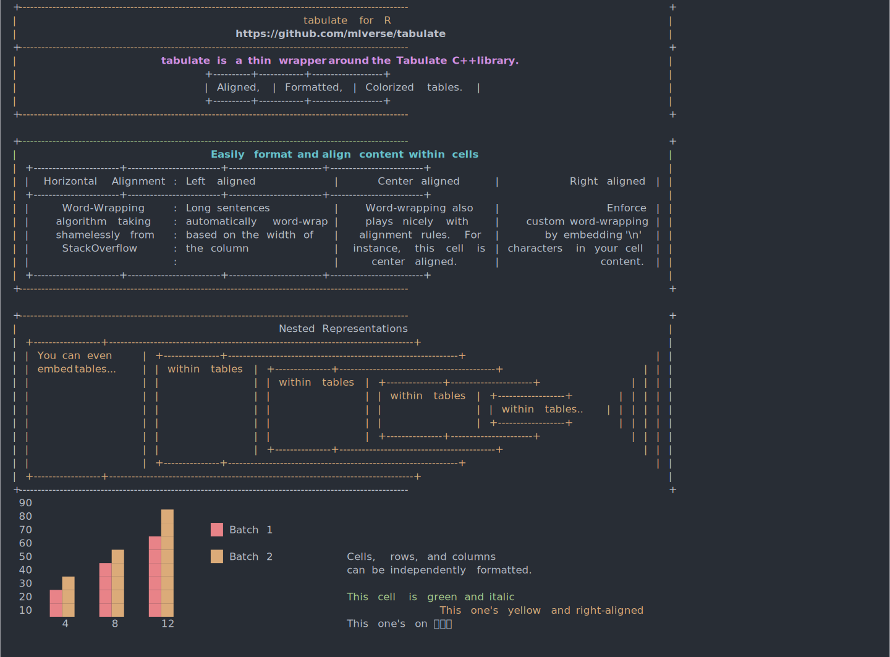
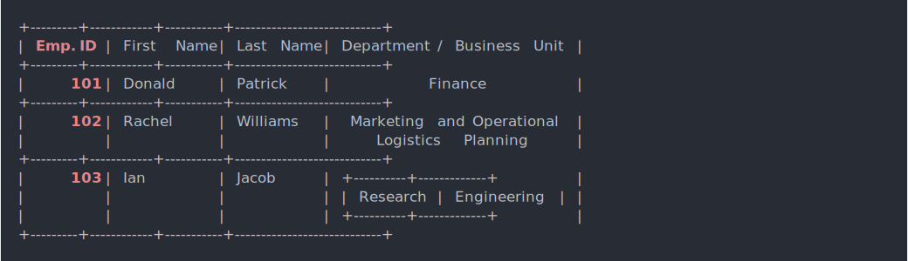

<!-- README.md is generated from README.Rmd. Please edit that file -->

# tabulate

<!-- badges: start -->

[](https://github.com/mlverse/tabulate/actions)
<!-- badges: end -->

Tabulate is a thin wrapper around the [tabulate C++
library](https://github.com/p-ranav/tabulate). It allows users to pretty
print tables in the console, with support for different font styles,
colors, borders and etc. It also supports multi-bytes characters and
nesting tables.



## Installation

tabulate can be installed from CRAN with:

    install.packages("tabulate")

You can install the development version of tabulate from
[GitHub](https://github.com/) with:

``` r
# install.packages("remotes")
remotes::install_github("mlverse/tabulate")
```

## Example

The following example shows basic functionality of tabulate. Like
formatting and coloring the output. Note that color and font styles are
only suppported in platforms that support ANSI strings. For a colored
version of this table see this
[link](https://mlverse.github.io/tabulate/articles/unicode.html).

``` r
library(tabulate)
department <- tabulate_table() %>% 
  table_add_row(c("Research", "Engineering"))

employees <- tabulate_table() %>% 
  table_add_row(
    c("Emp. ID", "First Name", "Last Name", "Department / Business Unit")) %>% 
  table_add_row(c("101", "Donald", "Patrick", "Finance")) %>% 
  table_add_row(
    c("102", "Rachel", "Williams", 
      "Marketing and Operational\nLogistics Planning")) %>% 
  table_add_row(c("103", "Ian", "Jacob", department))

employees[,1] %>% 
  format_font_style("bold") %>% 
  format_font_color("red") %>% 
  format_font_align("right")

employees[,4] %>% format_font_align("center") 
print(employees)
```



See the [example gallery](https://mlverse.github.io/tabulate/articles/)
for more.
